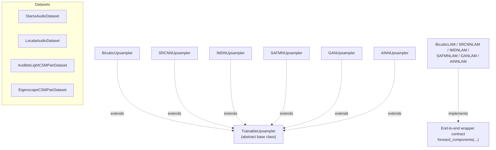

# Data and Extension Points

Main classes to extend when adding a new dataset or model family.

## Class Overview

## Data Contracts

| Contract | Used by | Required fields |
| --- | --- | --- |
| Inference audio sample | `src/infer.py` | `audio`, `sample_rate`, `file_id`, optional `ground_truth` |
| Training CSM sample | `src/train_upsamplers.py`, `src/train_end_to_end.py` | `S_low`, `S_high`, plus metadata |

## Extension Surfaces

| Surface | Where to change code |
| --- | --- |
| Add a new inference dataset | `src/data/`, then wire it into `src/infer.py` |
| Add a new standalone upsampler | `src/upsampler/`, then register it in `build_model(...)` |
| Add a new wrapper model | `src/lam_min/model/` and `src/training/end_to_end.py` |
| Add or rename a retained variant | `src/utils/model_variants.py` |
| Add new config keys | Relevant YAML file plus the code path that consumes the key |

## Design Pattern Used Throughout

The repository prefers explicit registries and narrow contracts over deep inheritance:

- datasets are plain loaders with predictable return dictionaries
- `*AudioDataset` names return raw audio records for inference-style workflows
- `*CSMPairDataset` names return `S_low`/`S_high` training samples
- the standalone trainer depends only on the `TrainableUpsampler` interface
- the end-to-end trainer depends on a wrapper that exposes `forward_components(...)`
- inference chooses models through a direct `if/elif` mapping in `src/infer.py`
