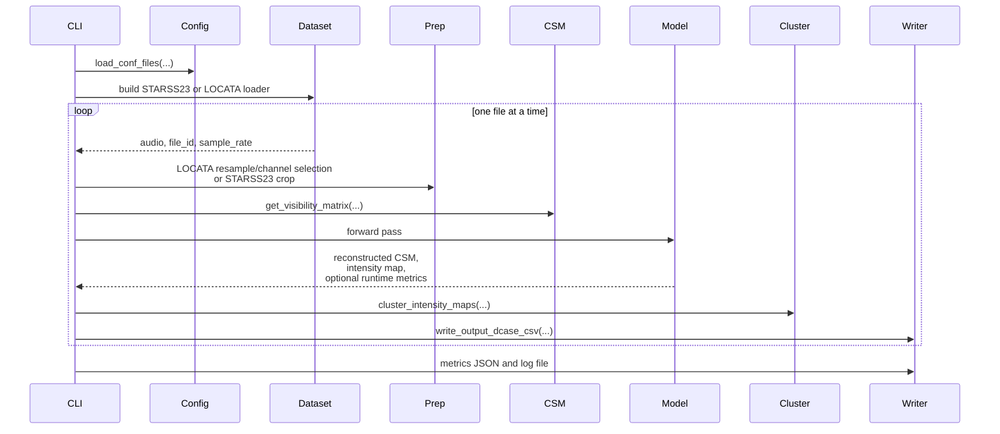

# Inference Pipeline

How one inference run moves from raw audio to DCASE-style predictions and metrics.
For measurement definitions, see [Scientific Benchmarking](../workflows/scientific-benchmarking.md).

## End-to-End Flow

## Stage Breakdown

| Stage | Main code path | Purpose |
| --- | --- | --- |
| Config load | `load_conf_files(...)` in `src/infer.py` | Reads `inference` and `dataset` sections from YAML, then resolves `inference.model_variant` into the runtime loader fields |
| Device resolution | `resolve_requested_device(...)` | Validates `cpu`, `mps`, or `cuda` and applies fall-backs |
| Dataset build | `StarssAudioDataset` or `LocataAudioDataset` | Provides file-level audio records |
| Audio preparation | `prepare_locata_audio_for_inference(...)` or STARSS23 crop branch | Resamples, crops, and selects channels when needed |
| Visibility frontend | `get_visibility_matrix(...)` | Converts audio into the complex representation used by the models |
| Model forward | `LAM` or one of the wrapper models | Produces the reconstructed CSM and intensity map |
| Post-processing | `cluster_intensity_maps(...)` | Turns the intensity map into source predictions |
| Output | `write_output_dcase_csv(...)` and metrics aggregation | Writes artefacts to disk and terminal output |

## Dataset-Specific Branches

| Dataset | Special handling |
| --- | --- |
| LOCATA | Optional task filtering, explicit resampling, optional 4-channel reduction |
| STARSS23 | Direct 4-channel load, optional crop via `max_audio_length_sec` |

## Model-Specific Branches

| Model family | Special handling |
| --- | --- |
| retained variant resolution | `src/infer.py` resolves `model_variant` to the wrapper class plus either separate retained checkpoints or one combined end-to-end checkpoint |
| `LAM` and `UpLAM` | `lam` and `uplam_dist` load directly from retained checkpoints |
| `BicubicLAM` | `bicubiclam_dist` resolves to `LAM.pth` only, while `bicubiclam_e2e_upfroz` resolves to one combined checkpoint |
| `UpLAM`, `SRCNNLAM`, `IMDNLAM`, `SAFMNLAM`, `GANLAM`, `AINNLAM` | `*_dist` resolves to an upsampler checkpoint plus `LAM.pth`, while `*_e2e_*` resolves to one combined wrapper checkpoint |

## Output Semantics

| Output | Meaning |
| --- | --- |
| DCASE CSV | Frame-level predicted events and directions |
| metrics JSON | Aggregated evaluation and runtime metrics for the run |
| terminal summary | Compact view of localisation and runtime metrics |
| log file | Optional file log driven by `inference.logging.handlers` |

When `benchmark_runtime_only` is enabled by the batch benchmark runner, the pipeline still writes per-file metrics JSON but skips DCASE prediction writing and SELD evaluation.
