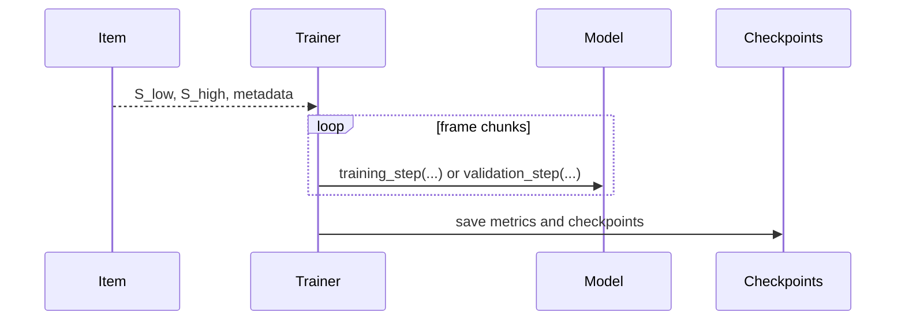

# Training Pipeline

Two related but distinct training flows: standalone upsampler training and end-to-end wrapper training.
For the shared schedule used to produce all retained checkpoints, see [Training Overview](../models/training-overview.md).

## Training Modes at a Glance

| Mode | Entry point | Trainable object | Saved checkpoint type |
| --- | --- | --- | --- |
| Standalone | `src/train_upsamplers.py` | `TrainableUpsampler` | Upsampler-only state dict |
| End-to-end | `src/train_end_to_end.py` | Wrapper containing `upsampler` and `lam` | Combined state dict with `upsampler.*` and `lam.*` keys |

## Shared File-Level Pattern

Both trainers operate on whole-file dataset items and then slice them into frame batches inside the training loop.

## Standalone Training

| Step | Behaviour |
| --- | --- |
| Build model | `build_model(...)` maps `model.name` to a standalone upsampler class |
| Build datasets | `build_dataset_list(...)` assembles AudibleLight and/or EigenScape |
| Build loader | `build_train_loader(...)` chooses proportional or balanced sampling |
| Run stage | `run_epoch(...)` delegates optimisation to the model's own training methods |
| Save results | Rolling and best checkpoints are written under `training.checkpoint_dir` |

## End-to-End Training

| Step | Behaviour |
| --- | --- |
| Build wrapper | `build_end_to_end_model(...)` maps `model.name` to a wrapper class |
| Initialise | `initialise_model(...)` resumes a combined checkpoint or warms the model from separate upsampler and LAM checkpoints |
| Build losses | `build_lam_loss(...)` creates the current `original_msetv` loss |
| Run stage | `run_epoch(...)` optimises either joint `loss_total = loss_lam_total + loss_aux` / GAN loss, or pure LAM loss when `training.freeze_upsampler` is enabled |
| Save results | Combined checkpoints are written under `training.checkpoint_dir` and default to the canonical retained `*_e2e_auxdis`, `*_e2e_upfroz`, or `*_e2e_auxen` prefix when `training.checkpoint_prefix` is empty |

## Stage Scheduling

Both trainers share the same stage concept:

- one config may define several ordered stages
- each stage may change the dataset mix, learning rate, file caps, and early stopping settings
- disabled stages are skipped without mutating later stages

## Why the Trainers Are Separate

| Question | Standalone answer | End-to-end answer |
| --- | --- | --- |
| Is LAM updated? | No | Yes, as part of the wrapper |
| Checkpoint format | Upsampler-only | Combined wrapper |
| Loss family | Model-owned reconstruction loss | Chunk-averaged `loss_total`: LAM reconstruction + LAM TV regularisation, plus optional weighted auxiliary loss while the upsampler remains trainable |
