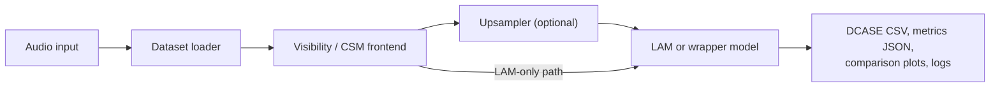

# Overview

Benchmarking framework for evaluating acoustic upsamplers in front of Latent Acoustic Mapping (LAM).

## What This Repository Does

The pipeline takes a low-channel acoustic input, computes its cross-spectral matrix (CSM), optionally upsamples that representation, and feeds the result into a LAM-based direction-of-arrival estimator.
The same codebase also provides training pipelines for standalone upsamplers and combined wrapper models.

## Quick Navigation

| Goal | Page |
| --- | --- |
| Install and first run | [Getting Started](getting-started.md) |
| Run one model locally | [Local Inference](workflows/local-inference.md) |
| Containerised inference | [Docker Inference](workflows/docker-inference.md) |
| Compare several models | [Batch Benchmarking](workflows/batch-benchmarking.md) |
| Understand measurement methodology | [Scientific Benchmarking](workflows/scientific-benchmarking.md) |
| Train a standalone upsampler | [Upsampler Training](workflows/upsampler-training.md) |
| Train an upsampler+LAM wrapper | [End-to-End Training](workflows/end-to-end-training.md) |
| YAML key reference | [Configuration Reference](reference/inference-config.md) |
| Available models and checkpoints | [Models](models/overview.md) |
| Shared training schedule | [Training Overview](models/training-overview.md) |

## Scope

- **LAM** and **UpLAM** are cited upstream methods; this site explains their use here but does not restate their full training provenance.
- Standalone and end-to-end training are separate workflows — see their respective pages.
