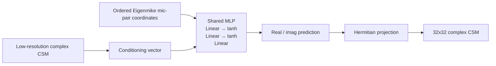

# Acoustics-Informed Neural Network (AINN)

Adapts the acoustics-informed neural network approach of Zhao and Ma [R16](../references.md#r16) ([R17](../references.md#r17)) to complex CSM reconstruction.

## Architecture

Unlike the convolutional families, AINN is a **coordinate-based implicit model**.
It predicts values directly at physical microphone-pair coordinates instead of refining a feature map with convolutions.

| Part | Setting |
| --- | --- |
| Hidden-layer depth | `2` hidden layers |
| Hidden width | `64` |
| Activation | `tanh` |
| Query coordinates | ordered Eigenmike mic-pairs `[x_i, y_i, z_i, x_j, y_j, z_j]` |
| Conditioning | flattened low-resolution real/imag CSM values |
| Regularisation | optional 3D Helmholtz residual (`pde_loss_weight: 0.5`, freq `100–4000 Hz`) |
| Total parameters | `0.153 M` (incl. LAM) |
| Loss | `mse` |

## Checkpoints

| Variant | Path | Notes |
| --- | --- | --- |
| `ainnlam_dist` | [`src/upsampler/ainn/checkpoints/ainn.pth`](https://github.com/PhilippXXY/upsampler-lam-benchmarking/blob/main/src/upsampler/ainn/checkpoints/ainn.pth) | Standalone upsampler |
| `ainnlam_e2e_auxdis` | `src/lam_min/checkpoints/e2e/ainnlam_e2e_auxdis.pth` | Joint upsampler + LAM, no auxiliary loss |
| `ainnlam_e2e_upfroz` | [`src/lam_min/checkpoints/e2e/ainnlam_e2e_upfroz.pth`](https://github.com/PhilippXXY/upsampler-lam-benchmarking/blob/main/src/lam_min/checkpoints/e2e/ainnlam_e2e_upfroz.pth) | Frozen upsampler, LAM-only training |

All checkpoints were trained with the shared schedule documented in [Training Overview](training-overview.md).
