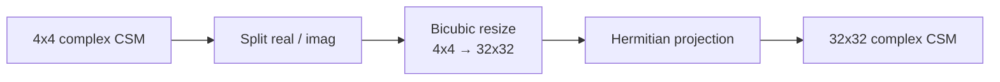

# Bicubic Interpolation

Fixed interpolation baseline for upsampling a 4-channel CSM before LAM, following Keys [R7](../references.md#r7).

## Architecture

No learned parameters — deterministic interpolation followed by Hermitian projection.
Uses PyTorch's `torch.nn.functional.interpolate` with `align_corners=False`.

## Checkpoints

| Variant | Path | Notes |
| --- | --- | --- |
| `bicubiclam_dist` | — | No checkpoint needed (deterministic); resolves to `LAM.pth` only |
| `bicubiclam_e2e_upfroz` | [`src/lam_min/checkpoints/e2e/bicubiclam_e2e_upfroz.pth`](https://github.com/PhilippXXY/upsampler-lam-benchmarking/blob/main/src/lam_min/checkpoints/e2e/bicubiclam_e2e_upfroz.pth) | LAM-only training with frozen bicubic front-end |

The end-to-end checkpoint was trained with the shared schedule documented in [Training Overview](training-overview.md).
