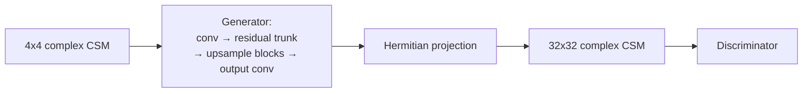

# Head-Related Transfer Function Generative Adversarial Network (GAN)

Adapts the HRTF upsampling GAN of Hogg et al. [R14](../references.md#r14) ([R15](../references.md#r15)) to complex CSM super-resolution.

## Architecture

A residual generator paired with a separate discriminator (used only during training).

| Part | Setting |
| --- | --- |
| Generator width | `128` feature channels |
| Residual blocks | `8` |
| Upsampling path | repeated `PixelShuffle(2)` blocks → `32×32` |
| Discriminator hidden widths | `64, 64, 128, 128, 256, 256, 512, 512` |
| Total parameters | `10.169 M` (incl. LAM + discriminator); `4.433 M` at inference (discriminator excluded) |
| Loss | `l1` content + adversarial (`adversarial_weight: 0.01`, `content_weight: 0.01`) |
| Critic schedule | `critic_iters: 4`, `discriminator_lr_scale: 5.0` |

## Checkpoints

| Variant | Path | Notes |
| --- | --- | --- |
| `ganlam_dist` | [`src/upsampler/gan/checkpoints/gan.pth`](https://github.com/PhilippXXY/upsampler-lam-benchmarking/blob/main/src/upsampler/gan/checkpoints/gan.pth) | Standalone upsampler |
| `ganlam_e2e_auxdis` | [`src/lam_min/checkpoints/e2e/ganlam_e2e_auxdis.pth`](https://github.com/PhilippXXY/upsampler-lam-benchmarking/blob/main/src/lam_min/checkpoints/e2e/ganlam_e2e_auxdis.pth) | Joint upsampler + LAM, no auxiliary loss |
| `ganlam_e2e_upfroz` | [`src/lam_min/checkpoints/e2e/ganlam_e2e_upfroz.pth`](https://github.com/PhilippXXY/upsampler-lam-benchmarking/blob/main/src/lam_min/checkpoints/e2e/ganlam_e2e_upfroz.pth) | Frozen upsampler, LAM-only training |

All checkpoints were trained with the shared schedule documented in [Training Overview](training-overview.md).
