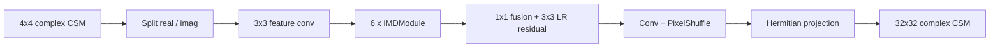

# Information Multi-distillation Network (IMDN)

Adapts the Information Multi-Distillation Network of Hui et al. [R10](../references.md#r10) ([R11](../references.md#r11)) to complex CSM upsampling.

## Architecture

IMDN is a lightweight convolutional model built around repeated feature distillation blocks and a sub-pixel reconstruction head.

| Part | Setting |
| --- | --- |
| Trunk depth | 6 IMD modules |
| Feature width | `64` |
| Fusion width | `32` |
| Upsampling head | convolution + `PixelShuffle(scale=8)` |
| Total parameters | `0.876 M` (incl. LAM) |
| Loss | `mse` |

## Checkpoints

| Variant | Path | Notes |
| --- | --- | --- |
| `imdnlam_dist` | [`src/upsampler/imdn/checkpoints/imdn.pth`](https://github.com/PhilippXXY/upsampler-lam-benchmarking/blob/main/src/upsampler/imdn/checkpoints/imdn.pth) | Standalone upsampler |
| `imdnlam_e2e_auxdis` | [`src/lam_min/checkpoints/e2e/imdnlam_e2e_auxdis.pth`](https://github.com/PhilippXXY/upsampler-lam-benchmarking/blob/main/src/lam_min/checkpoints/e2e/imdnlam_e2e_auxdis.pth) | Joint upsampler + LAM, no auxiliary loss |
| `imdnlam_e2e_upfroz` | [`src/lam_min/checkpoints/e2e/imdnlam_e2e_upfroz.pth`](https://github.com/PhilippXXY/upsampler-lam-benchmarking/blob/main/src/lam_min/checkpoints/e2e/imdnlam_e2e_upfroz.pth) | Frozen upsampler, LAM-only training |

All checkpoints were trained with the shared schedule documented in [Training Overview](training-overview.md).
