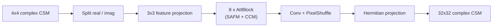

# Spatially-Adaptive Feature Modulation for Efficient Image Super-Resolution (SAFMN)

Adapts the Spatially-Adaptive Feature Modulation Network of Sun et al. [R12](../references.md#r12) ([R13](../references.md#r13)) to complex CSM upsampling.

## Architecture

SAFMN is a deeper feature-mixing model than SRCNN or IMDN — a lightweight but expressive convolutional upsampler.

| Part | Setting |
| --- | --- |
| Feature width | `64` |
| Feature blocks | `8` |
| SAFM levels | `4` |
| Feed-forward scale | `2.0` |
| Reconstruction head | convolution + `PixelShuffle(scale=8)` |
| Total parameters | `0.918 M` (incl. LAM) |
| Loss | `l1` + FFT loss (`fft_loss_weight: 0.1`) |

## Checkpoints

| Variant | Path | Notes |
| --- | --- | --- |
| `safmnlam_dist` | [`src/upsampler/safmn/checkpoints/safmn.pth`](https://github.com/PhilippXXY/upsampler-lam-benchmarking/blob/main/src/upsampler/safmn/checkpoints/safmn.pth) | Standalone upsampler |
| `safmnlam_e2e_auxdis` | `src/lam_min/checkpoints/e2e/safmnlam_e2e_auxdis.pth` | Joint upsampler + LAM, no auxiliary loss |
| `safmnlam_e2e_upfroz` | [`src/lam_min/checkpoints/e2e/safmnlam_e2e_upfroz.pth`](https://github.com/PhilippXXY/upsampler-lam-benchmarking/blob/main/src/lam_min/checkpoints/e2e/safmnlam_e2e_upfroz.pth) | Frozen upsampler, LAM-only training |

All checkpoints were trained with the shared schedule documented in [Training Overview](training-overview.md).
