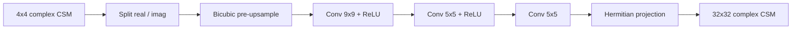

# Super-Resolution Convolutional Neural Network (SRCNN)

The SRCNN family adapts the classic image super-resolution pipeline of Dong et al. [R8](../references.md#r8) and a reference implementation from [R9](../references.md#r9) to complex CSM upsampling.

## How It Looks

SRCNN first enlarges the low-resolution input with bicubic interpolation and then refines that coarse estimate with a shallow convolutional stack.

## Architecture Summary

| Part | Repository setting |
| --- | --- |
| Input path | split complex tensor into two real-valued channels |
| Pre-upsampling | bicubic interpolation |
| Refinement stack | `Conv(2→64, 9×9)` → `Conv(64→32, 5×5)` → `Conv(32→2, 5×5)` |
| Total parameters | `0.209 M` (incl. LAM) |
| Loss | `mse` |

## Checkpoints

| Variant | Path | Notes |
| --- | --- | --- |
| `srcnnlam_dist` | [`src/upsampler/srcnn/checkpoints/srcnn.pth`](https://github.com/PhilippXXY/upsampler-lam-benchmarking/blob/main/src/upsampler/srcnn/checkpoints/srcnn.pth) | Standalone upsampler |
| `srcnnlam_e2e_auxdis` | [`src/lam_min/checkpoints/e2e/srcnnlam_e2e_auxdis.pth`](https://github.com/PhilippXXY/upsampler-lam-benchmarking/blob/main/src/lam_min/checkpoints/e2e/srcnnlam_e2e_auxdis.pth) | Joint upsampler + LAM, no auxiliary loss |
| `srcnnlam_e2e_upfroz` | [`src/lam_min/checkpoints/e2e/srcnnlam_e2e_upfroz.pth`](https://github.com/PhilippXXY/upsampler-lam-benchmarking/blob/main/src/lam_min/checkpoints/e2e/srcnnlam_e2e_upfroz.pth) | Frozen upsampler, LAM-only training |

All checkpoints were trained with the shared schedule documented in [Training Overview](training-overview.md).
