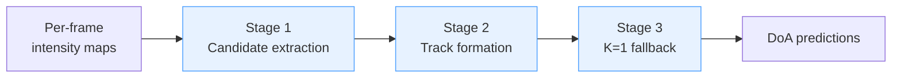
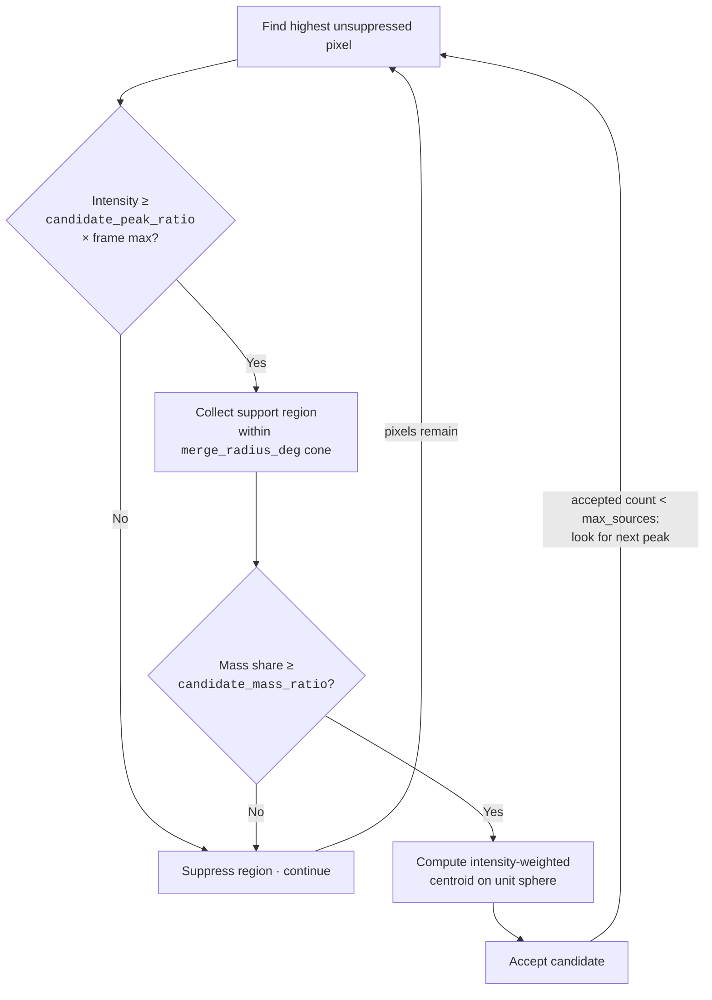
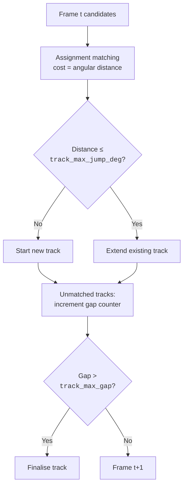

# DoA Extraction Pipeline

Each model forward pass produces per-frame intensity maps $I \in \mathbb{R}^{F \times B \times P}$, where $F$ is the number of frames, $B$ frequency bands, and $P$ pixels on a Fibonacci-sampled unit sphere.
Direction-of-Arrival (DoA) predictions are extracted from these maps by the sequence-level clustering pipeline in `src/lam_min/trainer/kmeans.py`.

## Pipeline Overview

When `adaptive_k: true`, the pipeline runs through three stages.

---

## Stage 1 — Per-Frame Candidate Extraction

**Method:** `_pick_frame_candidates`

For each non-silent frame (frame maximum $\geq$ `activity_threshold` $\times$ file maximum), up to `max_sources` candidates are extracted by iterative greedy peak picking:

**Key details:**

- `max_sources` caps how many candidates are extracted **per frame** — once that many have been accepted, peak picking stops for that frame regardless of remaining pixels.
- The support-region cone is defined by the dot-product criterion $\hat{r}_i \cdot \hat{r}_p \geq \cos(\theta_\text{merge})$, where $\hat{r}_p$ is the unit vector of the peak pixel.
- On a Fibonacci sphere with $P = 484$ pixels, a 25° cone covers ≈ 23 pixels (≈ 4.8% of uniform energy). Setting `candidate_mass_ratio: 0.05` admits any genuine concentrated source while rejecting flat-background noise.
- Each accepted candidate stores: direction, peak-relative intensity (`peak_rel`), mass share, and a **band support** score (fraction of the 9 frequency bands whose support-region energy exceeds `band_peak_ratio` of the band maximum).

---

## Stage 2 — Temporal Track Formation

**Method:** `_link_tracks`

Candidates from all frames are linked into temporal tracks using a modified **Jonker-Volgenant algorithm** (`scipy.optimize.linear_sum_assignment`).

- **Cost**: great-circle angular distance between the track's last direction and the candidate.
- **Acceptance**: only if distance $\leq$ `track_max_jump_deg` (default 20°, matching the DCASE evaluation threshold).
- **Gap tolerance**: unmatched active tracks accumulate a gap counter and are finalised only after `track_max_gap` consecutive empty frames (default 3 = 300 ms). This bridges low-energy transitions without fragmenting sources.

### Track retention criteria

After all frames are processed, tracks must satisfy **all three** quality gates:

| Criterion | Parameter | Default | Rationale |
| --------- | --------- | ------- | --------- |
| Minimum active frames | `track_min_frames` | 3 | Rejects single-frame spurious peaks |
| Minimum coverage ratio | `track_min_active_ratio` | 0.05 | Suppresses transient ghost tracks on long recordings |
| Minimum mean `peak_rel` | `track_min_peak_rel` | 0.5 | Rejects tracks from weak, off-peak energy |

---

## Stage 3 — K=1 Fallback

Surviving tracks only cover frames where at least one track was active.
For any frame that has candidates but **no surviving-track prediction**, the pipeline falls back to a single $K=1$ weighted k-means call.

This fallback is critical for single-source recordings where no track reaches the minimum length or coverage thresholds.
