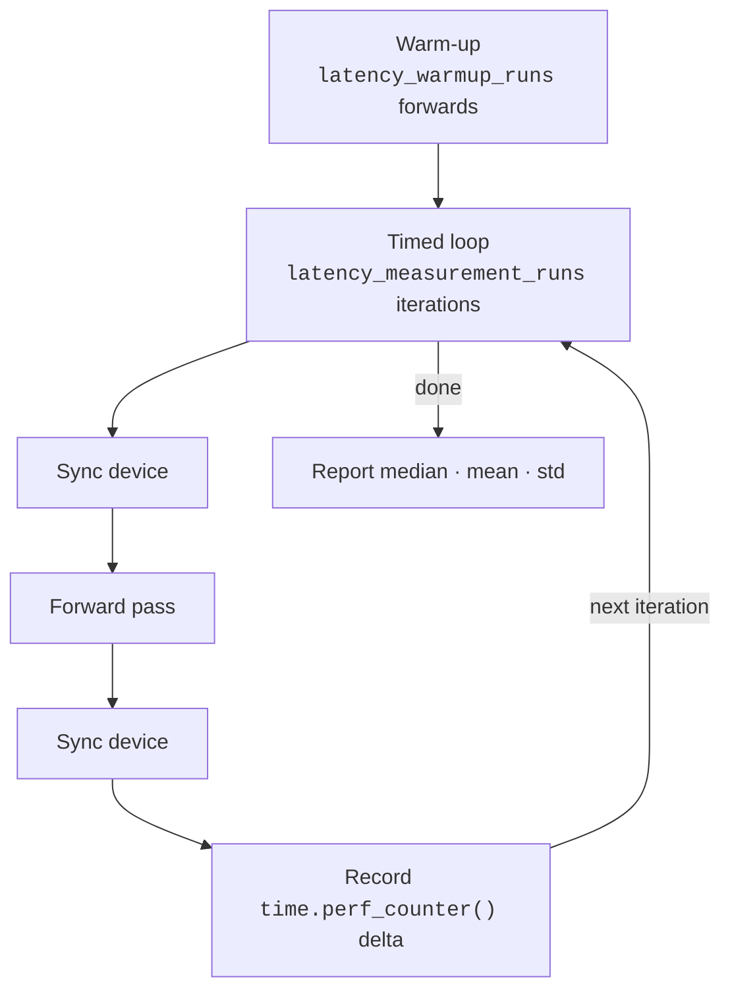

# Latency Methodology

Latency is measured as steady-state wall-clock runtime of the actual model forward pass.

## Measurement Protocol

For each measured callable the benchmark:

1. Runs `latency_warmup_runs` warm-up forwards (results discarded).
2. For each of `latency_measurement_runs` timed forwards:
      - synchronises the active accelerator **before** timing
      - executes the forward pass
      - synchronises **after**
      - records elapsed wall-clock time via `time.perf_counter()`
3. Reports **median**, mean, and population standard deviation.

The **median** is the primary latency figure — it is more robust to transient noise than a single timed forward.

### Device synchronisation

| Backend | Sync call |
| ------- | --------- |
| CUDA    | `torch.cuda.synchronize(device)` |
| MPS     | `torch.mps.synchronize()` |
| CPU     | *(none needed)* |

Synchronisation ensures that asynchronous accelerator work is fully completed before the timer reads, so the measurement reflects true forward runtime.

## Composite-Model Latency

For models with a distinct upsampler stage followed by a LAM stage, `total_time_ms` is **not** taken from a direct end-to-end timed forward.
Instead it is derived as:

$$
t_{\text{total}} = t_{\text{upsampler}} + t_{\text{lam}}
$$

where $t_{\text{total}}$ maps to `total_time_ms`, $t_{\text{upsampler}}$ to `upsampler_time_ms`, and $t_{\text{lam}}$ to `lam_total_time_ms`.

### Why?

`torch.linalg.eigh()` — the dominant operation inside LAM — is **data-dependent**: it converges measurably faster on the low-rank, smooth CSMs produced by bicubic interpolation from a 4-channel subarray than on real full-rank 32-channel CSMs.
A direct end-to-end forward therefore **systematically underestimates** composite-model latency and can produce the paradoxical result that *Bicubic + LAM appears faster than standalone LAM*.

Summing independently measured component times guarantees:

- `total_time_ms` for any composite model is always bigger than the standalone LAM `total_time_ms`.
- The LAM component latency is measured on **real CSM inputs** (the actual upsampler output), so it is representative of the true operating condition.

For standalone LAM (no upsampler component), `total_time_ms` is the direct end-to-end timed forward, unchanged.
