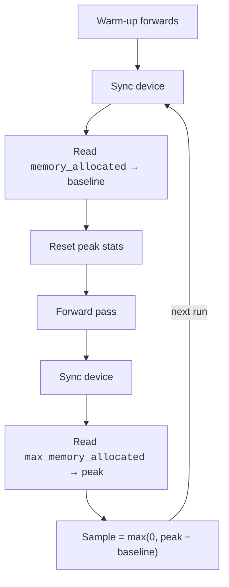

# Peak-Memory Methodology

Peak memory is measured as the maximum allocation **delta** above a warmed baseline — not total device or board memory.

## Measurement Backends

The benchmark supports two backends with different precision characteristics.

### CUDA (preferred)

1. Run `memory_warmup_runs` warm-up forwards.
2. Before each measured forward:
      - synchronise the device
      - read `torch.cuda.memory_allocated(device)` as baseline
      - reset peak stats via `torch.cuda.reset_peak_memory_stats(device)`
3. Run the forward pass.
4. Synchronise again.
5. Read `torch.cuda.max_memory_allocated(device)`.
6. Sample = `max(0, peak_allocated − baseline_allocated)`.

### CPU / MPS (fallback)

| Method | Mechanism | Limitation |
| ------ | --------- | ---------- |
| `psutil` (preferred) | RSS polling at `memory_poll_interval_ms` | Can miss sub-poll spikes; includes non-tensor process memory |
| `tracemalloc` (fallback) | Python allocator tracking | Sees only Python-managed allocations, not native state |

For scientific reporting, **CUDA peak memory is the stronger measurement backend**.

## Raw vs Normalised Memory

The benchmark exposes two memory surfaces that answer different questions.

| Surface | Workload | Use case |
| ------- | -------- | -------- |
| **Raw** | Real evaluation workload (dataset split, frame width, file subset, duration policy) | Deployment-style reporting on a specific workload |
| **Normalised** | Same file IDs, each reshaped to a canonical **10.0 s** duration (crop long, zero-pad short) | Cross-dataset memory comparison with fixed workload size |

The normalised pass is runtime-only — it skips prediction CSV writing and SELD evaluation.
