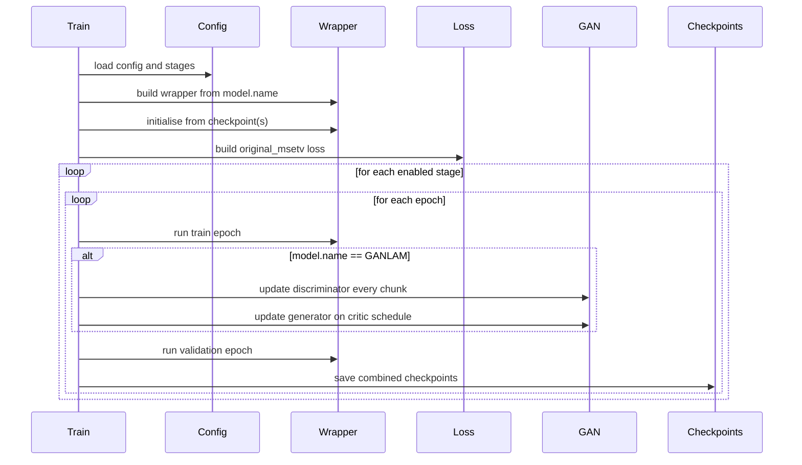

# End-to-End Training

Train a wrapper model containing both an upsampler and LAM.
For the shared training schedule used to produce all retained checkpoints, see [Training Overview](../models/training-overview.md).

## Entry Point

```bash
uv run python src/train_end_to_end.py --config config/train_end_to_end.yaml --device cpu
```

## CLI Arguments

| Argument | Default | Meaning |
| --- | --- | --- |
| `--config` | `config/train_end_to_end.yaml` | End-to-end training config path |
| `--device` | config-driven | Requested training device: `cpu`, `mps`, or `cuda` |
| `--resume-checkpoint` | empty | Optional combined wrapper checkpoint used to resume training |

## Supported Wrapper Names

| `model.name` | Repository class |
| --- | --- |
| `UpLAM` | `lam_min.model.UpLAM.UpLAM` |
| `BicubicLAM` | `lam_min.model.BicubicLAM.BicubicLAM` |
| `SRCNNLAM` | `lam_min.model.SRCNNLAM.SRCNNLAM` |
| `IMDNLAM` | `lam_min.model.IMDNLAM.IMDNLAM` |
| `SAFMNLAM` | `lam_min.model.SAFMNLAM.SAFMNLAM` |
| `GANLAM` | `lam_min.model.GANLAM.GANLAM` |
| `AINNLAM` | `lam_min.model.AINNLAM.AINNLAM` |

## What Changes Relative to Standalone Training

Compared with `src/train_upsamplers.py`, this trainer:

- builds a wrapper model rather than a standalone upsampler
- initialises from `lam_checkpoint` plus an optional model-specific `upsampler_checkpoint`, or from one combined checkpoint supplied by `--resume-checkpoint`, `training.resume_from_checkpoint`, or `initialisation.resume_checkpoint`. `BicubicLAM` leaves `upsampler_checkpoint` empty
- supports three retained end-to-end modes: joint training without the extra auxiliary loss (`*_e2e_auxdis`), frozen-upsampler LAM-only training (`*_e2e_upfroz`), and joint training with the auxiliary loss enabled (`*_e2e_auxen`)
- optimises the original-method LAM loss plus an optional auxiliary upsampler loss when the upsampler remains trainable; for `*_e2e_auxen`, the applied auxiliary multiplier is calibrated once from a temporary random-init probe model before the first optimiser step
- writes combined checkpoints whose state dict contains wrapper weights. Most models save both `upsampler.*` and `lam.*`, while `BicubicLAM` saves `lam.*` only
- derives the default checkpoint prefix from `model.name`, `training.freeze_upsampler`, and `loss.aux_enabled` when `training.checkpoint_prefix` is left empty, for example `srcnnlam_e2e_upfroz`, `srcnnlam_e2e_auxen`, or `bicubiclam_e2e_upfroz`

## Runtime Notes

- On Apple Silicon, a requested `mps` device falls back to CPU because the current LAM path uses `float64` and `complex128`.
- `loss.lam_method` is currently fixed to `original_msetv`.
- In joint AuxEn mode, `loss.aux_weight` is a configured fraction of the initial LAM contribution, not a direct multiplier. The trainer measures `initial_lam_total / initial_aux_raw` from one random-initialised probe wrapper on a real training chunk and applies `effective_aux_weight = aux_weight * (initial_lam_total / initial_aux_raw)` for the full run.
- The non-GAN end-to-end path now uses Adam rather than AdamW. The retained HPC e2e configs use `learning_rate: 1.0e-6` and `weight_decay: 1.0e-4` to stay aligned with the optimiser settings described in the original LAM paper.
- `training.freeze_upsampler: true` freezes the whole upsampler branch, keeps it in eval mode, and restricts optimisation to the LAM parameters. This mode requires `loss.aux_enabled: false`.
- `GANLAM` uses separate Adam optimisers for `upsampler.generator + lam` and `upsampler.discriminator` only while the upsampler remains trainable. In `*_e2e_upfroz`, it falls back to the standard LAM-only path.
- Resume precedence is `--resume-checkpoint` > `training.resume_from_checkpoint` > `initialisation.resume_checkpoint` > separate warm-start checkpoints.
- The temporary AuxEn calibration model ignores `initialisation.*`. Only the real training wrapper is initialised from warm-start or resume checkpoints.
- If training is throughput-limited, prefer `precomputed_csm_root` over `cache_csm`. The former persists CSM tensors on disk across runs, the latter only caches them in memory inside one process.

## Precompute CSM Once

If `data.*.precomputed_csm_root` is set, you can materialise the CSM tensors once before training:

```bash
uv run python src/precompute_training_csm.py \
  --config config/train_end_to_end.yaml \
  --splits train val
```

This writes per-file `.pt` tensors under the configured cache root and lets later epochs load `S_low` and `S_high` directly instead of recomputing visibility matrices from raw audio.

## Outputs

| Artefact | Meaning |
| --- | --- |
| combined wrapper checkpoint | Contains both upsampler and LAM state and uses the canonical retained `*_e2e_auxdis`, `*_e2e_upfroz`, or `*_e2e_auxen` prefix when the config leaves `checkpoint_prefix` empty |
| `output/training_end_to_end/train_end_to_end_metrics_*.json` | Saved training metadata and history |
| stage and rolling best/last checkpoints | Written under the configured checkpoint directory |

## Typical Commands

```bash
# Default end-to-end config
uv run python src/train_end_to_end.py

# Explicit config and CPU
uv run python src/train_end_to_end.py --config config/train_end_to_end.yaml --device cpu

# Resume from a combined wrapper checkpoint
uv run python src/train_end_to_end.py \
  --config config/train_end_to_end.yaml \
  --device cuda \
  --resume-checkpoint src/lam_min/checkpoints/e2e/srcnnlam_e2e_upfroz_best.pth

# Precompute train/val CSM tensors before a long run
uv run python src/precompute_training_csm.py \
  --config config/train_end_to_end.yaml \
  --splits train val
```

See [End-to-End Training Config](../reference/train-end-to-end-config.md) for the full key reference.

## Training Flow


