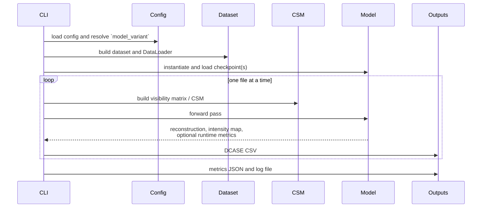

# Local Inference

Run one configured model on one dataset from the local environment.

## Entry Point

```bash
uv run python src/infer.py --config config/inference_config.yaml --device cpu
```

## CLI Arguments

| Argument | Default | Meaning |
| --- | --- | --- |
| `--config` | `config/inference_config.yaml` | Path to the YAML file that defines the run |
| `--device` | `cpu` | Requested runtime device: `cpu`, `mps`, or `cuda` |
| `--input-channel-indices` | omitted | Space-separated canonical Eigenmike indices required by variable-SRCNN variants |

Notes:

- `mps` falls back to CPU for `lam_min`-based models.
- The inference loop expects `batch_size: 1`.
- `inference.model_variant` is resolved in `src/infer.py` into the wrapper class and checkpoint source(s).

## Supported Datasets

| `inference.data_set` | Input shape at runtime |
| --- | --- |
| `locata` | 32 channels for `LAM`, 4 channels for the wrapper models after channel selection |
| `starss23` | 4 channels |

## Typical Commands

```bash
# Use the default config on CPU
uv run python src/infer.py

# Run with an explicit config
uv run python src/infer.py --config /path/to/inference_config.yaml --device cpu

# Request CUDA if available
uv run python src/infer.py --config config/inference_config.yaml --device cuda
```

Typical `inference.model_variant` values include `lam`, `uplam_dist`, `bicubiclam_dist`, `bicubiclam_e2e_upfroz`, `srcnnlam_dist`, `srcnnlam_e2e_upfroz`, and `ainnlam_e2e_auxen`.

## What the Script Does



## Output Layout

Each run creates a timestamped subdirectory under `inference.output_path`:

| Artefact | What it contains |
| --- | --- |
| `MODELVARIANT-YYYY-MM-DD_HH-MM-SS/` | Per-run output directory |
| DCASE CSV files | One prediction file per processed recording |
| `metrics_*.json` | Aggregate runtime, evaluation, and frame-wise correlation matrix distance (CMD) metrics when `collect_metrics: true` |
| log file | Only if a file logging handler is configured |

The terminal summary table reports:

- evaluation metrics such as SELD score, localisation error, and localisation recall
- LAM runtime metrics
- upsampler runtime metrics
- CMD medians for available CSM-stage comparisons
- raw-upsampler CSM validity diagnostics, including Hermitian residual and PSD-projection residual

When a CMD comparison involves the raw upsampler stage, inference first projects that stage tensor
to a Hermitian PSD matrix before computing CMD. This keeps the CMD values meaningful for models
whose learned upsampler output is not itself a valid correlation matrix.
