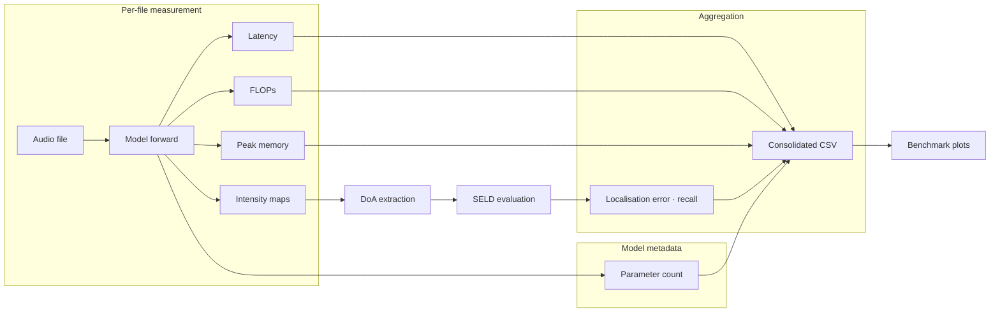

# Scientific Benchmarking

Defines what the benchmarking workflow measures, how measurements are aggregated, and what can and cannot be compared.
Detailed methodology is split into focused sub-pages.

| Sub-page | Covers |
| -------- | ------ |
| [Latency Methodology](benchmarking/latency.md) | Warm-up protocol, device sync, composite-model latency derivation |
| [Peak-Memory Methodology](benchmarking/memory.md) | CUDA vs CPU/MPS backends, non-additivity, raw vs normalised surfaces |
| [DoA Extraction Pipeline](benchmarking/doa-extraction.md) | Candidate extraction, temporal track formation, K=1 fallback |

---

## Measurement Surfaces

The benchmark exposes two distinct end-to-end memory surfaces:

| Surface | Workload | Question it answers |
| ------- | -------- | ------------------- |
| **Raw** | Real evaluation workload (dataset, frame width, file subset) | "What is the memory footprint on this specific workload?" |
| **Normalised** | Same files, each forced to **10.0 s** (crop / zero-pad) | "What is the footprint on a controlled workload comparable across datasets?" |

See [Peak-Memory Methodology → Raw vs Normalised](benchmarking/memory.md#raw-vs-normalised-memory) for details.

---

## Per-File Metrics

For every processed file, `src/infer.py` writes one metrics row to `metrics_*.json`.

### End-to-end fields (used in plots and CSV)

| Field | Description |
| ----- | ----------- |
| `total_time_ms` | End-to-end latency. For composite models derived as `upsampler_time_ms + lam_total_time_ms` (see [Latency → Composite Models](benchmarking/latency.md#composite-model-latency)). |
| `total_flops` | End-to-end FLOPs |
| `total_memory_mb` | End-to-end peak memory delta |
| `total_params` | Total number of model parameters (constant per variant) |

### Component fields (diagnostic only)

| Field | Description |
| ----- | ----------- |
| `lam_total_time_ms` / `lam_flops` / `lam_memory_mb` | LAM-only isolated pass |
| `upsampler_time_ms` / `upsampler_flops` / `upsampler_memory_mb` | Upsampler-only isolated pass |

Component memory is kept in the raw JSON and terminal summary but is **not** used in plots or the consolidated CSV.

### Correlation Matrix Distance fields (diagnostic and CSV)

Each available CMD comparison is stored with three reductions:

| Field suffix | Description |
| ----- | ----------- |
| `_per_frame_per_band` | Nested list with one CMD value per frame and frequency band |
| `_per_frame` | One CMD value per frame, computed as the median over finite band CMD values |
| `_median` | Median over the file's per-frame CMD values |

The currently emitted comparisons are:

- `cmd_reference_to_upsampler_*`
- `cmd_upsampler_to_lam_*`
- `cmd_reference_to_lam_*`
- `cmd_reference_to_lam_denoise1_*`
- `cmd_reference_to_lam_denoise2_*`
- `cmd_reference_to_lam_denoise3_*`
- `cmd_reference_to_lam_denoise4_*`

For the two comparisons that involve the raw upsampler stage, the upsampler tensor is first
projected to the nearest Hermitian PSD matrix before CMD is computed. The raw upsampler validity is
logged separately via:

- `upsampler_hermitian_residual_*`
- `upsampler_psd_projection_residual_*`

---

## Aggregation to CSV

The consolidated CSV is built per retained variant.

### Latency & GFLOPs (frame-normalised)

| CSV field | Formula |
| --------- | ------- |
| `latency_per_frame_ms` | `sum(total_time_ms) / total_frames` |
| `gflops_per_frame` | `sum(total_flops) / total_frames` |
| `lam_latency_per_frame_ms` | `sum(lam_total_time_ms) / total_frames` |
| `lam_gflops_per_frame` | `sum(lam_flops) / total_frames` |

### Memory

| CSV field | Reduction |
| --------- | --------- |
| `memory_peak_max_mb` | Worst-case raw end-to-end peak |
| `memory_peak_median_mb` | Median raw end-to-end peak |
| `normalised_memory_peak_max_mb` | Worst-case from the 10.0 s pass |
| `normalised_memory_peak_median_mb` | Median from the 10.0 s pass |

### Correlation Matrix Distance

| CSV field | Reduction |
| --------- | --------- |
| `cmd_reference_to_upsampler_median` | Global median over all frame-level `reference -> upsampler` CMD values after Hermitian-PSD projection of the upsampler output |
| `cmd_upsampler_to_lam_median` | Global median over all frame-level `upsampler -> lam_final` CMD values after Hermitian-PSD projection of the upsampler output |
| `cmd_reference_to_lam_median` | Global median over all frame-level `reference -> lam_final` CMD values |
| `cmd_reference_to_lam_denoise1_median` | Global median over all frame-level `reference -> lam_denoise1` CMD values |
| `cmd_reference_to_lam_denoise2_median` | Global median over all frame-level `reference -> lam_denoise2` CMD values |
| `cmd_reference_to_lam_denoise3_median` | Global median over all frame-level `reference -> lam_denoise3` CMD values |
| `cmd_reference_to_lam_denoise4_median` | Global median over all frame-level `reference -> lam_denoise4` CMD values |

### Localisation

| CSV field | Source |
| --------- | ------ |
| `localisation_error_deg` | Full raw evaluation |
| `localisation_recall` | Full raw evaluation (native 0..1 scale) |
| `prediction_to_reference_ratio` | Predicted event count divided by reference event count |
| `localisation_error_sample_standard_deviation_deg` | File-level sample standard deviation with `ddof=1` |
| `localisation_recall_sample_standard_deviation` | File-level sample standard deviation with `ddof=1` on the native 0..1 scale |

### Model Complexity

| CSV field | Source |
| --------- | ------ |
| `total_params` | Total parameter count from `model.parameters()` |

The normalised pass does not contribute localisation or parameter-count metrics.
