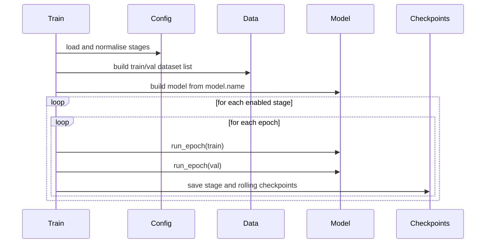

# Upsampler Training

Train a standalone upsampler on low/high-resolution CSM pairs.
For the shared training schedule used to produce all retained checkpoints, see [Training Overview](../models/training-overview.md).

## Entry Point

```bash
uv run python src/train_upsamplers.py --config config/train_upsamplers.yaml --device cuda
```

## CLI Arguments

| Argument | Default | Meaning |
| --- | --- | --- |
| `--config` | `config/train_upsamplers.yaml` | Training config path |
| `--device` | config-driven | Requested training device: `cpu`, `mps`, or `cuda` |
| `--resume-checkpoint` | empty | Optional checkpoint used to initialise model weights before training |

## Supported Model Names

| `model.name` | Repository class |
| --- | --- |
| `BicubicUpsampler` | `upsampler.bicubic.model.BicubicUpsampler` |
| `SRCNNUpsampler` | `upsampler.srcnn.model.SRCNNUpsampler` |
| `IMDNUpsampler` | `upsampler.imdn.model.IMDNUpsampler` |
| `SAFMNUpsampler` | `upsampler.safmn.model.SAFMNUpsampler` |
| `GANUpsampler` | `upsampler.gan.model.GANUpsampler` |
| `AINNUpsampler` | `upsampler.ainn.model.AINNUpsampler` |

## Training Shape

The trainer is deliberately small and model-agnostic:

- datasets yield file-level `S_low` and `S_high` tensors
- the trainer slices those file tensors into frame chunks using `frame_batch_size`
- each model owns its own optimisation logic through `training_step(...)` and `validation_step(...)`



## Stage-Based Scheduling

Each `training.stages[]` entry can override:

- `epochs`
- `learning_rate`
- `weight_decay`
- `max_train_files`
- `max_val_files`
- `train_sampling`
- `early_stopping_patience`
- `early_stopping_min_delta`
- dataset enables for `audiblelight` and `eigenscape`


See [Upsampler Training Config](../reference/train-upsamplers-config.md) for the full key reference.

## Resume Options

- `--resume-checkpoint` resumes from a specific checkpoint path supplied on the command line.
- `training.resume_from_checkpoint` provides the same behavior from the YAML config.
- If both are set, the CLI flag wins.

## Precompute CSM Once

If `data.*.precomputed_csm_root` is set, you can materialise the CSM tensors once before training:

```bash
uv run python src/precompute_training_csm.py \
  --config config/train_upsamplers.yaml \
  --splits train val
```

This stores per-file `.pt` tensors on disk and lets later epochs load `S_low` and `S_high` directly. It is sometimes is a better throughput optimisation than `cache_csm: true`, which only caches tensors in memory for one process.

## Outputs

| Artefact | Meaning |
| --- | --- |
| `*_stage_last.pth` | Rolling checkpoint for the current stage |
| `*_stage_best.pth` | Best checkpoint seen within the current stage |
| `*_last.pth` | Rolling checkpoint across the whole run |
| `*_best.pth` | Best overall validation checkpoint |
| `output/training/train_metrics_*.json` | Saved training metadata and loss history |

## Typical Commands

```bash
# Default config
uv run python src/train_upsamplers.py

# Explicit config and device
uv run python src/train_upsamplers.py --config config/train_upsamplers.yaml --device cuda

# Warm-start from an existing checkpoint
uv run python src/train_upsamplers.py \
  --config config/train_upsamplers.yaml \
  --device mps \
  --resume-checkpoint src/upsampler/gan/checkpoints/gan_pretrain_audiblelight_light_best.pth

# Precompute train/val CSM tensors before a long run
uv run python src/precompute_training_csm.py \
  --config config/train_upsamplers.yaml \
  --splits train val
```
